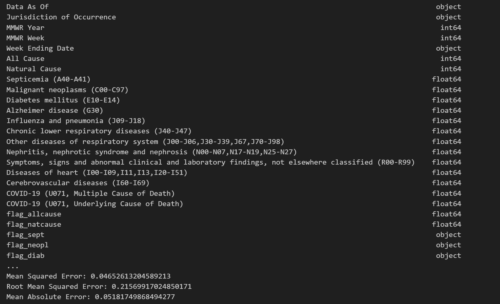

# Project-4
Project 4

## Project Participants
 * Ian Lee
 * Byron De Leon
 * Navdeep Kaur
 * Paul Ku
 * Jeff Morgan

For Project 4, our team worked with machine learning (ML) with the other technologies we’ve learned solve, analyze, and visualize a project decodeding opensource information to discover a problem worth solving, analyzing, or visualizing.

## Please visit our interactive Tableau Visiualization 
* [Click Here to Visit Tableau](https://public.tableau.com/app/profile/navdeep.kaur6193/viz/DecodingDeath/DecodingDeath)

###	Decoding Death

### Our group project attempts to analize weekly provisional counts of deaths by state and select causes for the years 2020-2023. The ultimate goal was to build a regression model to predict the total number of deaths based on various features like year, month, and jurisdiction of occurrence to predict the most likely causes of death in each state for 2024.

* Our Group stared by working with a Python script using pandas for data manipulation and scikit-learn for machine learning tasks, particularly regression analysis.
  
* 

# Here's a breakdown of what's happening:

*	Initially we loaded a CSV file using pandas' read_csv function.

### The data was processed with the following steps:

*	Converting  the "Week Ending Date" column to datetime format.
*	Created new columns for year, month, and day extracted from the "Week Ending Date".
*	Aggregated the data by year, month, and jurisdiction of occurrence, summing up the "All Cause" column.
*	Handling Missing Values: You've printed the count of missing values in the aggregated dataset.

*	One-hot encoding was performed on the "Jurisdiction of Occurrence" column to encode the categorical variables.

*	**Scikit-learn** was used to standardize the numerical feature

*	The dataset was split the into training and testing sets.

###	Model Training and Evaluation:

*	We trained a decision tree regression model (DecisionTreeRegressor) on the training data and evaluated its performance on the testing data using metrics such as Mean Squared Error (MSE), Root Mean Squared Error (RMSE), Mean Absolute Error (MAE), and R-squared.
Later, you've performed hyperparameter tuning using grid search (GridSearchCV) to find the best hyperparameters for the decision tree regressor model.

* Finally, we trained another decision tree regression model with the best hyperparameters found from grid search and evaluated its performance on the testing data.

